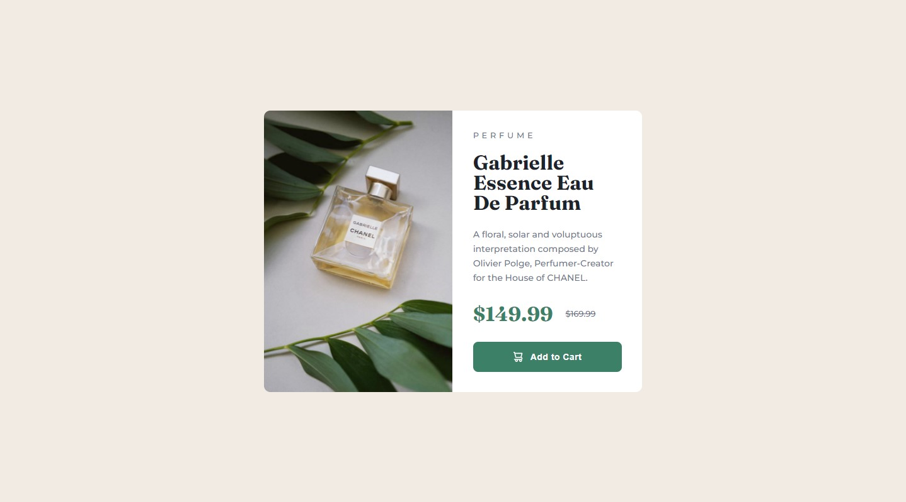
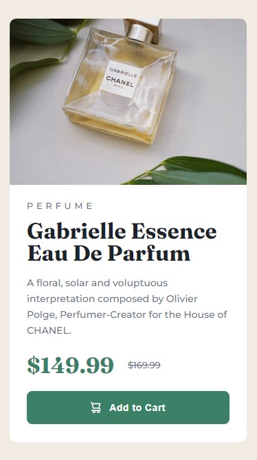

# Frontend Mentor - Product preview card component solution

This is a solution to the [Product preview card component challenge on Frontend Mentor](https://www.frontendmentor.io/challenges/product-preview-card-component-GO7UmttRfa). Frontend Mentor challenges help you improve your coding skills by building realistic projects. 


## Table of contents

- [Overview](#overview)
  - [The challenge](#the-challenge)
  - [Screenshot](#screenshot)
  - [Links](#links) 
- [My process](#my-process)
  - [Built with](#built-with)
  - [What I learned](#what-i-learned)
  - [Continued development](#continued-development)
  - [Useful resources](#useful-resources)
- [Author](#author)


## Overview

### The challenge

Users should be able to:

- View the optimal layout depending on their device's screen size (375 px / 1440 px)
- See hover and focus states for interactive elements

### Screenshot



- 1440px



- 375px

### Links

- Solution URL: [Solution URL]()
- Live Site URL: [Live site URL](https://somebodyidk.github.io/FM-Product-Preview-Card/)


## My process

### Built with

- Semantic HTML5 markup
- CSS custom properties
- Flexbox

### What I learned

Learned about letter-spacing. 

```css
.btn {
    ...
    letter-spacing: 0.03rem;
}
```

### Continued development

I will focus on CSS, because there is still things that I need to improve.

### Useful resources

- [Letter Spacing](https://developer.mozilla.org/en-US/docs/Web/CSS/letter-spacing) - This helped me to learn about letter-spacing.


## Author

- Frontend Mentor - [@Somebodyidk](https://www.frontendmentor.io/profile/Somebodyidk)
